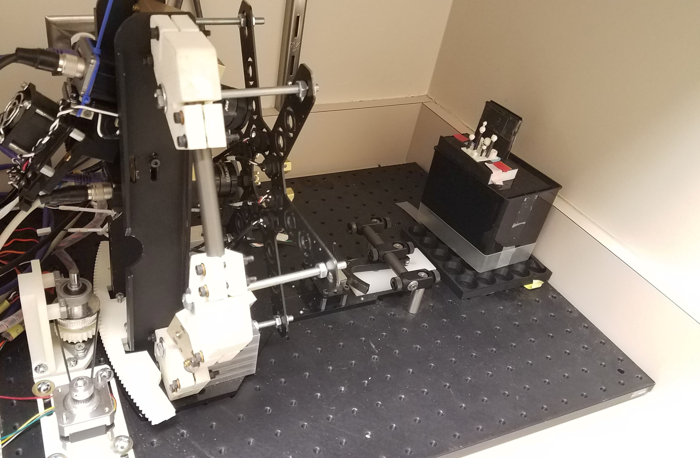
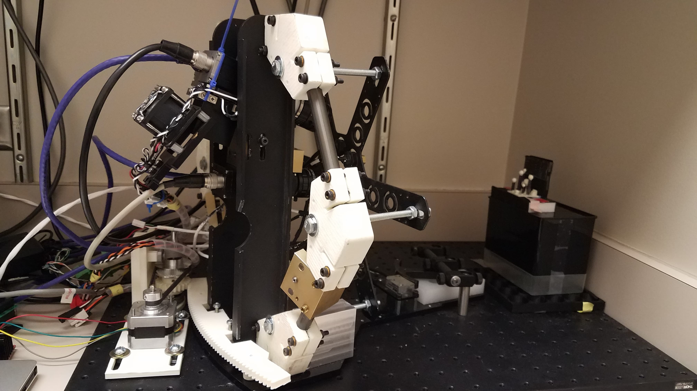
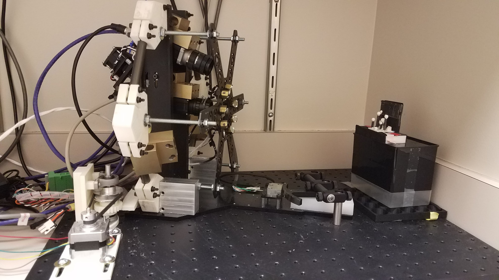
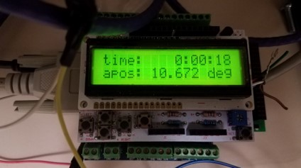
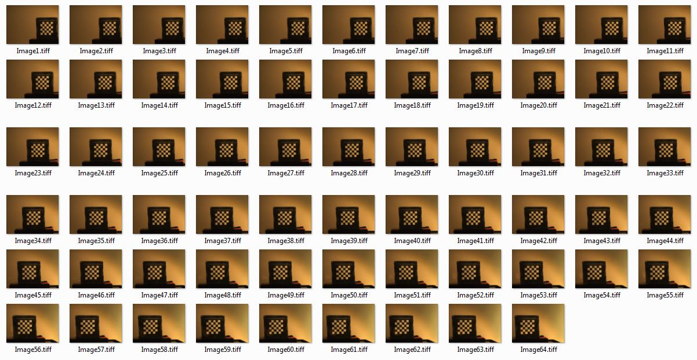
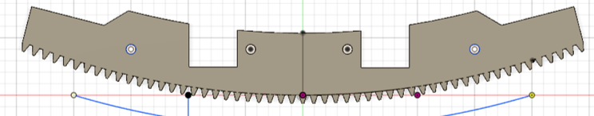

# Deep-Learning-Internship-Summer-2019-Texas-Childrens-Hospital-Radiology-Department
Built prototype device which acquires images from 3 cameras across 60 degrees and reconstructs a 3D image of object using CNN and Synthetic Aperture Imaging

The Prototype Device - Automatically acquires images using MATLAB & Arduino integrated software which captures images of object at defined degree intervals from multiple cameras.

'

The initial position from which the device acquires images at specific degree intervals.

'

The final position that the device acquires images yielding an image range of 60 degrees.

'

                            Encoder determines the angle of the device which is integrated with MATLAB software to enable image acquisition at precise degree intervals.

'

 
64 Images of checkerboard calibration object taken by the device at half-degree intervals.

'

                           3D model of the gear arc used to move the device in small step intervals. Various components were designed using 3D Modeling Software in the creation of the device including the gear, motor structure, device reinforcement parts, phantom test object, etc. Plan to print these components in metal instead of plastic.

